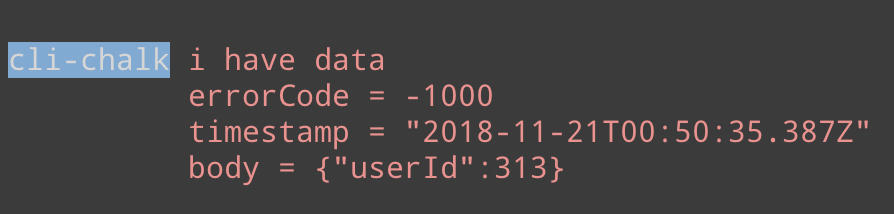

# cli-chalk
helper for cli and script console logs

## installation
`npm i -D cli-chalk`

## usage
```js
const log = require("cli-chalk");
log.config.name = "my-cli";

log.success("updated something!");

log.error("this is not right :(");

log.warn("im warning you...");

log.info("for your information");
```


## fluent logger
```js
const { logger } = require("cli-chalk");

const data = {
    userId: 313
}

logger
    .error("i have data")
    .data("errorCode", -1000)
    .data("timestamp", new Date())
    .data("body", data)
    .write();
```




## config
```js
{
    name: "cli-chalk",
    nameColor: chalk.bgBlue,
    successColor: chalk.green,
    errorColor: chalk.red,
    warnColor: chalk.keyword('orange'),
    infoColor: chalk.blue
}
```